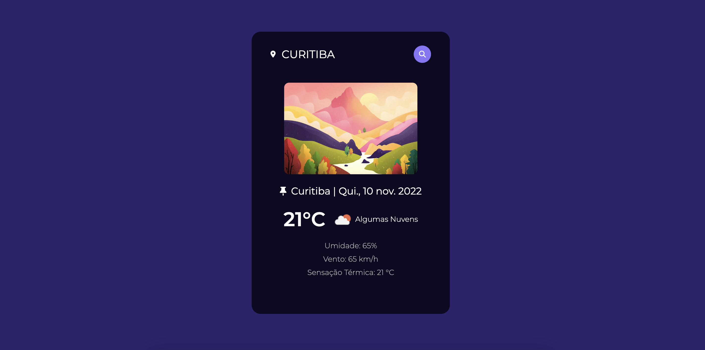

# ☁️ Página de Clima Tempo

> Página de Clima Tempo fictícia feita para estudos e aprimoramento das habilidades de Front-End. 

Consiste em uma página da web feita para conferir as condições climáticas atuais de uma cidade ou país. Através do uso de uma API, após a inserção da cidade/país desejado, as informações climáticas atuais aparecem em tela, juntamente com uma imagem que se altera conforme com a hora do dia (dia e noite), de acordo com o horário local, e a aparição da data atual.

[Deploy](https://weather-app-beajohnke.vercel.app/).

### 💻 Tecnologias Utilizadas
  

